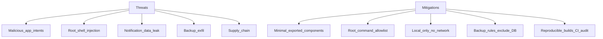

# Security Policy

## Supported versions

| Version | Supported |
|---------|-----------|
| 1.1.x   | Yes |
| 1.0.x   | Yes |
| < 1.0   | No |

Security fixes are released as patch versions with entries in [`docs/CHANGELOG.md`](docs/CHANGELOG.md) under **Security**.

---

## Reporting a vulnerability

**Screen Wakelock Detector** holds sensitive privileges (notification listener, optional root). Please report security issues responsibly.

### Preferred contact

1. **GitLab confidential issue** on the project repository (when published), or
2. Email the maintainer listed in GitLab profile / project README

Include:

- Description and impact
- Steps to reproduce
- Affected version(s)
- Suggested fix (optional)

We aim to acknowledge within **72 hours** and provide a remediation timeline for confirmed issues.

**Do not** open public issues for undisclosed vulnerabilities.

---

## Threat model

| Threat | Mitigation |
|--------|------------|
| **Intent hijacking / malicious caller** | Non-essential components `android:exported="false"`; validate intent extras; explicit intents; no dynamic code load |
| **Root command injection** | **Allowlist only** in `RootCommandRunner` — fixed commands (`dumpsys power`, etc.); never interpolate user input; timeouts + output size caps |
| **Notification listener abuse (if app compromised)** | Minimize stored fields (channel ID + package; no bodies by default); Room DB app-private |
| **Backup / cloud sync leakage** | `android:allowBackup="false"` or `backup_rules.xml` excluding wake DB |
| **User-initiated SAF export** | Settings → Export backup writes JSON to user-chosen storage via Storage Access Framework; no network; user controls destination file |
| **Network exfiltration** | No `INTERNET` permission; no WebView remote URLs |
| **Supply-chain / trojaned build** | Reproducible builds, FOSS license CI, Dependabot, signed release tags |
| **Privilege escalation via exported service** | `NotificationListenerService` system-bound only; no custom IPC exported to other apps |
| **Deep link abuse** | Internal navigation validated; reject unknown `highlight=` permission keys |

---

## Security implementation by milestone

| Milestone | Deliverable |
|-----------|-------------|
| **M0** | This file; Apache-2.0 LICENSE; dependency license CI; no INTERNET in manifest |
| **M2** | Notification cache metadata-only; listener strips sensitive extras |
| **M3** | `RootCommandAllowlist` enum; unit tests reject arbitrary strings |
| **M5** | Gate GS: exported component audit, backup rules, penetration checklist |

---

## Gate GS checklist

See [`docs/GATES.md`](docs/GATES.md) for full checklist:

- INTERNET absent from release manifest (CI)
- Only launcher activity exported
- Root allowlist unit tests
- Notification schema review — no message body by default
- Backup excludes wake database
- No critical Dependabot CVEs at release

---

## Data handling summary

- All wake and attribution data stored **locally**
- No analytics or crash reporting SDKs
- Optional root runs **fixed allowlisted commands** only

Full privacy detail: [`docs/PRIVACY.md`](docs/PRIVACY.md)

---

## Disclosure policy

1. Reporter submits confidential report
2. Maintainers confirm and develop fix on private branch if needed
3. Release patch version `vX.Y.Z` with CHANGELOG **Security** entry
4. Credit reporter in CHANGELOG if desired (with permission)

---

## Safe harbor

We support good-faith security research on your own devices. Do not access others' data, disrupt services, or violate applicable law.
