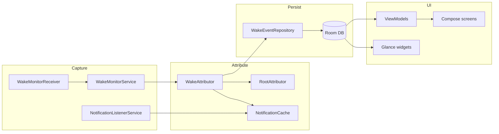

# Architecture

Screen Wakelock Detector is a single-module Android app (`:app`) with a layered structure: foreground monitoring service → attribution → Room persistence → Compose UI and Glance widgets.

---

## Data flow

---

## Layers

| Layer | Packages | Responsibility |
|-------|----------|----------------|
| **Service** | `service/` | `WakeMonitorService` listens for screen on/off, invokes attribution, inserts events, updates widgets, optional threshold alerts |
| **Domain** | `domain/` | `WakeAttributor`, `InsightsCalculator`, models (`WakeEvent`, `WakeEventIdentity`), pure logic helpers |
| **Data** | `data/` | Room entities/DAOs, `WakeEventRepository`, `PreferencesRepository`, notification cache |
| **UI** | `ui/` | Jetpack Compose Material 3 screens, navigation, Hilt ViewModels |
| **Root** | `root/` | libsu command runner, dumpsys parsers, allowlisted shell commands |
| **Widgets** | `widget/` | Glance home-screen widgets and Quick Settings tile |

---

## Wake capture path

1. **Screen on** — `WakeMonitorReceiver` or `DisplayManager.DisplayListener` notifies `WakeMonitorService`.
2. **Attribution** — `WakeAttributor` correlates notification cache, usage stats, and optional root dumpsys within a time window.
3. **Persist** — `WakeEventRepository.insert()` writes to Room; logcat records `latencyMs`.
4. **Notify** — Optional local alert via `WakeAlertNotifier`; widgets refresh via `WakeWidgetReceiver`.

---

## UI and filtering

- **History / Home / widgets** filter ignored packages through `WakeEventFilters` and `WakeEventIdentity.effectivePackage()`.
- **Deep links** (`screenwakelock://…`) route through `DeepLinkParser` → `AppNavigation`.

### Display names

| Context | Source |
|---------|--------|
| Compose UI, widgets, alerts, History search | `AppDisplayResolver` (PackageManager labels + offline fallbacks) |
| CSV/JSON export | Raw `attributedAppLabel` / `attributedPackage` in `ExportUtils` |
| Offline helpers / tests | `WakeEventDisplayNames.offlineAppName` |
| `WakeEvent.displayAppName` | Delegates to `WakeEventDisplayNames` — **not** used for user-visible UI |

---

## Dependency injection

Hilt modules in `di/` provide singletons: repositories, attributors, `AppDisplayResolver`, root stack.

---

## Related docs

- [`DESIGN_SYSTEM.md`](DESIGN_SYSTEM.md) — Material 3 tokens and components
- [`ROOT.md`](ROOT.md) — Root command allowlist
- [`PERMISSIONS.md`](PERMISSIONS.md) — Runtime and special access
- [`FOSS.md`](FOSS.md) — Dependency policy
