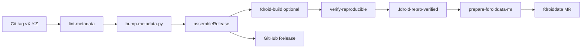

# F-Droid distribution

Build instructions, metadata, and automated fdroiddata MR pipeline for **Screen Wakelock Detector**.

**Distribution:** [F-Droid](https://f-droid.org/) official repo only — no Google Play.

**Upstream:** https://github.com/edwardlthompson/screen-wakelock-detector

---

## Build from source

### Prerequisites

- JDK 17 (Temurin)
- Android SDK (API 35, build-tools pinned in project)
- Git

### Commands

```bash
git clone https://github.com/edwardlthompson/screen-wakelock-detector.git
cd screen-wakelock-detector
./gradlew assembleRelease
```

Release APK: `dist/Screen-Wakelock-Detector-{versionName}.apk` when signed locally or in CI, else `app/build/outputs/apk/release/app-release-unsigned.apk`.

Local signed build: `bash scripts/release/build-signed-apk.sh` (see `keystore.properties.example`). GitHub Actions secrets: `RELEASE_STORE_FILE_B64`, `RELEASE_STORE_PASSWORD`, `RELEASE_KEY_ALIAS`, `RELEASE_KEY_PASSWORD` — sync via `bash scripts/release/push-github-secrets.sh`.

Release builds enable **R8 minification** (`isMinifyEnabled = true`) and **resource shrinking** (`isShrinkResources = true`). ProGuard mapping is written to `app/build/outputs/mapping/release/mapping.txt` — retain this artifact for crash deobfuscation. CI runs `scripts/release/verify-release-apk.sh` after `assembleRelease` (requires mapping file; rejects debug-only artifacts; 25 MB size ceiling).

Signing: release keystore **not** in repo. F-Droid may use dev key or reproducible co-signing per [F-Droid reproducible builds](https://f-droid.org/docs/Reproducible_Builds/).

---

## Reproducible builds

Configured from **v1.0.0** (hard to add later without reinstall).

| Item | Implementation |
|------|----------------|
| Pinned Gradle wrapper, AGP, Kotlin | `gradle/wrapper`, `app/build.gradle.kts` |
| Verify script | `scripts/fdroid/verify-reproducible.sh` |
| Verify stamp | `.fdroid-repro-verified` (written on PASS) |
| CI — GitLab | `reproducible-verify` job on `v*` tags |
| CI — GitHub | `reproducible-verify` job in `fdroid-publish.yml` |

When both upstream release APK and F-Droid builder APK exist, `verify-reproducible.sh` compares SHA-256 hashes (and optionally `apksigcopier` / `diffoscope`).

Set `REQUIRE_REPRO_VERIFY=1` to block fdroiddata MR if verify has not passed.

---

## In-repo metadata

| File | Purpose |
|------|---------|
| [`fdroid/metadata/com.screenwakelock.detector.yml`](../fdroid/metadata/com.screenwakelock.detector.yml) | Source-of-truth; synced to fdroiddata fork |
| [`.fdroid.yml`](../.fdroid.yml) | In-repo F-Droid CI build recipe |
| `fastlane/metadata/android/en-US/` | Store listing text + changelogs |

### Anti-features (honest declaration)

| Anti-feature | Applies? |
|--------------|----------|
| NonFreeNet | No — no network permission |
| Tracking | No |
| Ads | No |
| KnownVuln | Monitor via Dependabot |

```yaml
RequiresRoot: false   # root enhances but not required
```

---

## First-time inclusion (one-time HUMAN)

1. **Fork** [fdroid/fdroiddata](https://gitlab.com/fdroid/fdroiddata) on GitLab
2. Copy `fdroid/metadata/com.screenwakelock.detector.yml` to fork `metadata/com.screenwakelock.detector.yml`
3. Push branch → fdroiddata CI validates build; respond to packager questions
4. Open MR to official fdroiddata
5. After merge, F-Droid build server publishes the app
6. Run reproducible verify against first published APK
7. Add `AllowedAPKSigningKeys` / `Binaries` to metadata when using upstream-signed reproducible builds

---

## Release automation (M7)

On every tag `vX.Y.Z`:



### Scripts

| Script | Purpose |
|--------|---------|
| `scripts/fdroid/lint-metadata.sh` | Required fields, Apache-2.0, Builds section |
| `scripts/fdroid/bump-metadata.py` | Sync `CurrentVersion` / `Builds` from Gradle |
| `scripts/fdroid/verify-reproducible.sh` | Hash-compare upstream vs F-Droid APK |
| `scripts/release/verify-release-apk.sh` | Release APK + mapping + size ceiling after assembleRelease |
| `scripts/fdroid/prepare-fdroiddata-mr.sh` | Lint → bump → verify gate → open MR |
| `scripts/fdroid/open-fdroiddata-mr.sh` | Push metadata branch to fdroiddata fork |

### CI workflows

| Platform | Workflow / job | Trigger |
|----------|------------------|---------|
| **GitHub** | `.github/workflows/release.yml` | `v*` → GitHub Release + APK |
| **GitHub** | `.github/workflows/fdroid-publish.yml` | `v*` → lint, bump, verify, fdroiddata MR |
| **GitLab** | `fdroid-build`, `reproducible-verify`, `fdroiddata-mr` | `v*` tags |

### Required secrets / variables

Configure in GitHub **Settings → Secrets** and GitLab **CI/CD → Variables**:

| Name | Used by | Description |
|------|---------|-------------|
| `FDROIDDATA_FORK_URL` | MR scripts | SSH or HTTPS URL of your fdroiddata fork |
| `GITLAB_TOKEN` | `glab mr create` | Token with `api` scope for fdroiddata MR |
| `RELEASE_STORE_FILE` | GitLab assemble-release | Optional release signing keystore path |

If `FDROIDDATA_FORK_URL` is unset, CI skips MR creation (safe default before fork exists).

---

## Agent runbook (post-M7)

### Standard release (`vX.Y.Z`)

1. Ensure [`docs/CHANGELOG.md`](CHANGELOG.md) has `## [X.Y.Z]` section
2. Confirm `versionName` / `versionCode` in `app/build.gradle.kts` match the tag
3. Merge to `main`; create and push tag: `git tag -a vX.Y.Z -m "..." && git push origin vX.Y.Z`
4. **GitHub Actions** runs `release.yml` + `fdroid-publish.yml`
5. **GitLab** (if configured): monitor pipeline stages validate → test → build → fdroid → publish
6. Confirm `reproducible-verify` green when `fdroid-build` artifact exists; stamp file `.fdroid-repro-verified` uploaded
7. Confirm `fdroiddata-mr` job pushed branch to your fork (or run locally):
   ```bash
   export FDROIDDATA_FORK_URL=git@gitlab.com:YOU/fdroiddata.git
   export CI_COMMIT_TAG=vX.Y.Z
   bash scripts/fdroid/prepare-fdroiddata-mr.sh
   ```
8. Track fdroiddata MR on GitLab until merged by F-Droid team
9. After merge, app updates on F-Droid within normal build cycle (days to ~1 week)
10. Update [`AGENT_MEMORY.md`](AGENT_MEMORY.md) with MR URL and verify result

### Local dry-run (no push)

```bash
DRY_RUN=1 bash scripts/fdroid/prepare-fdroiddata-mr.sh
bash scripts/smoke/m7_smoke.sh
```

### Reproducible verify locally

```bash
./gradlew assembleRelease
UPSTREAM_APK=app/build/outputs/apk/release/app-release-unsigned.apk \
  FDROID_APK=/path/to/fdroid-built.apk \
  bash scripts/fdroid/verify-reproducible.sh
```

### When verify fails

1. Run `diffoscope` on both APKs (script prints hint)
2. Check Gradle non-determinism (timestamps, version codes)
3. Document blocker in `AGENT_MEMORY.md`; do **not** set `SKIP_REPRO_VERIFY=1` for production MR unless packager agrees
4. Fix and re-tag patch release

---

## fastlane / store listing

- `fastlane/metadata/android/en-US/short_description.txt` — ≤80 chars
- `fastlane/metadata/android/en-US/full_description.txt` — full listing
- `fastlane/metadata/android/en-US/changelogs/{versionCode}.txt` — per-release notes
- Screenshots: add under `fastlane/metadata/android/en-US/images/` before first F-Droid listing

---

## UpdateCheckMode

Metadata uses `UpdateCheckMode: Tags` — F-Droid checkupdates bot polls Git tags as backup to the CI MR flow.

---

## Troubleshooting

| Issue | Action |
|-------|--------|
| fdroid build fails | Read CI `fdroid-build` log; compare SDK pins in `.fdroid.yml` |
| Reproducible mismatch | Run `verify-reproducible.sh` locally; use `diffoscope` |
| MR job skipped | Set `FDROIDDATA_FORK_URL` secret; fork fdroiddata first |
| MR rejected | Address packager feedback; update metadata Anti-features |
| `glab` not found | Push succeeds; open MR manually on GitLab |

Log outcomes in [`AGENT_MEMORY.md`](AGENT_MEMORY.md).
