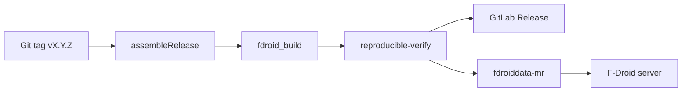

# F-Droid distribution

Build instructions, metadata, and automated fdroiddata MR pipeline for **Screen Wakelock Detector**.

**Distribution:** [F-Droid](https://f-droid.org/) official repo only — no Google Play.

---

## Build from source

### Prerequisites

- JDK 17 (Temurin)
- Android SDK (API 35, build-tools pinned in project)
- Git

### Commands

```bash
git clone https://gitlab.com/<namespace>/screen-wakelock-detector.git
cd screen-wakelock-detector
./gradlew assembleRelease
```

Release APK: `app/build/outputs/apk/release/app-release.apk`

Signing: release keystore **not** in repo. F-Droid may use dev key or reproducible co-signing per [F-Droid reproducible builds](https://f-droid.org/docs/Reproducible_Builds/).

---

## Reproducible builds

Configured from **v1.0.0** (hard to add later without reinstall).

| Item | Implementation |
|------|----------------|
| Pinned Gradle wrapper, AGP, Kotlin | Version catalog + wrapper |
| Deterministic APK | `gradle.properties` archive order; no timestamps where possible |
| Verify script | `scripts/fdroid/verify-reproducible.sh` |
| CI job | `reproducible-verify` on `v*` tags |

Use `diffoscope` to compare upstream vs F-Droid builder APK when debugging.

---

## In-repo metadata

| File | Purpose |
|------|---------|
| [`fdroid/metadata/com.screenwakelock.detector.yml`](../fdroid/metadata/com.screenwakelock.detector.yml) | Source-of-truth; sync to fdroiddata fork |
| [`.fdroid.yml`](../.fdroid.yml) | In-repo F-Droid CI build recipe |
| `fastlane/metadata/android/en-US/` | Store listing text + screenshots |

### Anti-features (honest declaration)

| Anti-feature | Applies? |
|--------------|----------|
| NonFreeNet | No — no network permission |
| Tracking | No |
| Ads | No |
| KnownVuln | Monitor via Dependabot |

```yaml
RequiresRoot: false   # root enhances but not required
```

---

## First-time inclusion (M5)

1. **Fork** [fdroid/fdroiddata](https://gitlab.com/fdroid/fdroiddata) on GitLab
2. Copy `fdroid/metadata/com.screenwakelock.detector.yml` to fork `metadata/`
3. Push branch → fdroiddata CI validates build `[HUMAN]` responds to packager questions
4. Open MR to official fdroiddata
5. After merge, F-Droid build server publishes app
6. Verify reproducible build: local signed APK vs F-Droid output

---

## Release automation (M7+)

On tag `vX.Y.Z`:



| Step | Tool |
|------|------|
| Bump metadata | `scripts/fdroid/bump-metadata.py` |
| Lint metadata | `scripts/fdroid/lint-metadata.sh` |
| Open MR | `scripts/fdroid/open-fdroiddata-mr.sh` |
| Verify APK hash | `scripts/fdroid/verify-reproducible.sh` |

**CI variables:** see [`GITLAB.md`](GITLAB.md) — `FDROIDDATA_FORK_URL`, `GITLAB_TOKEN`, signing vars.

After first inclusion merged, configure `AllowedAPKSigningKeys` + `Binaries` for upstream-signed reproducible publishes.

---

## Agent runbook (post-M7)

1. Merge release to `main`; tag `v1.2.0` matching `versionName`
2. Monitor GitLab pipeline: validate → test → build → fdroid → publish
3. Confirm `reproducible-verify` green
4. Approve or auto-run `fdroiddata-mr` job
5. Track fdroiddata MR until merged
6. Confirm app updates on F-Droid within normal build cycle
7. Update [`CHANGELOG.md`](CHANGELOG.md) and [`AGENT_MEMORY.md`](AGENT_MEMORY.md)

---

## fastlane / store listing

- `short_description.txt` — ≤80 chars for F-Droid summary
- `full_description.txt` — full listing
- Screenshots: permission-grant slides + core UI — see [`ONBOARDING.md`](ONBOARDING.md)

---

## UpdateCheckMode

Metadata template uses `Tags` — F-Droid checkupdates bot polls Git tags as backup to CI MR flow.

---

## Troubleshooting

| Issue | Action |
|-------|--------|
| fdroid build fails | Read CI `fdroid-build` log; compare SDK/NDK pins |
| Reproducible mismatch | Run verify-reproducible.sh locally; diffoscope APKs |
| MR rejected | Address packager feedback; update metadata Anti-features |

Log outcomes in [`AGENT_MEMORY.md`](AGENT_MEMORY.md).
